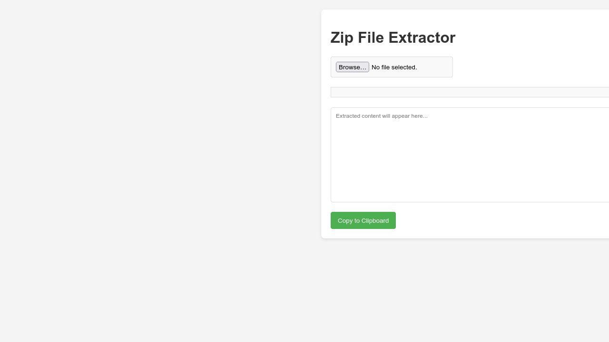
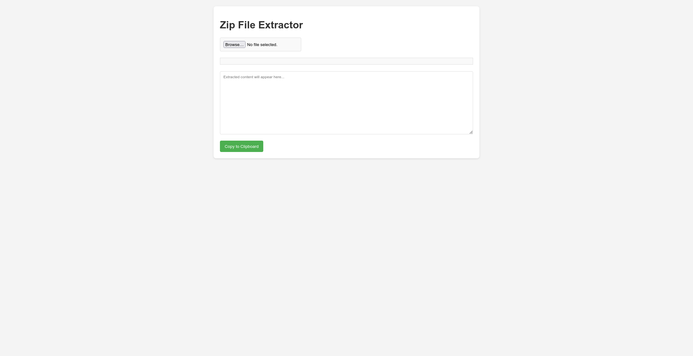
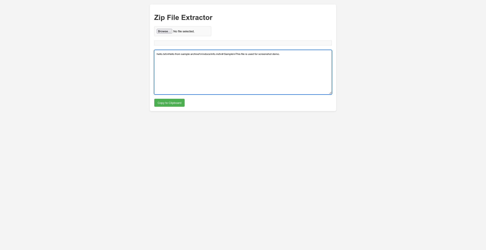

# Browser ZIP Extractor

## English
A small client-side utility for opening ZIP archives directly in the browser.

### Features
- Upload a ZIP file from the browser.
- Inspect archive file names and extracted content.
- Static HTML/CSS/JavaScript implementation.

### Screenshots

### Run locally
Use any static file server and open the project in a browser. Example: Python built-in HTTP server on port 8000.

## Русский
Небольшая client-side утилита для просмотра ZIP-архивов прямо в браузере.

### Возможности
- Upload a ZIP file from the browser.
- Inspect archive file names and extracted content.
- Static HTML/CSS/JavaScript implementation.

### Скриншоты

### Локальный запуск
Запусти любой статический HTTP-сервер и открой проект в браузере. Например, встроенный Python HTTP server на порту 8000.

## Українська
Невелика client-side утиліта для перегляду ZIP-архівів прямо в браузері.

### Можливості
- Upload a ZIP file from the browser.
- Inspect archive file names and extracted content.
- Static HTML/CSS/JavaScript implementation.

### Скріншоти

### Локальний запуск
Запусти будь-який статичний HTTP-сервер і відкрий проєкт у браузері. Наприклад, вбудований Python HTTP server на порту 8000.
